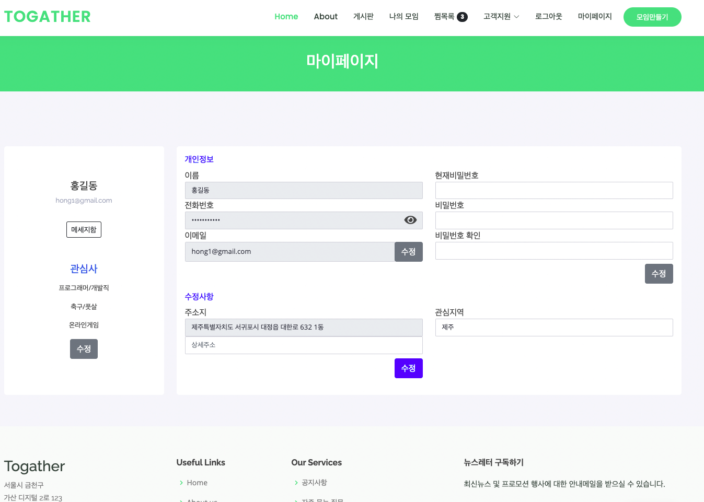
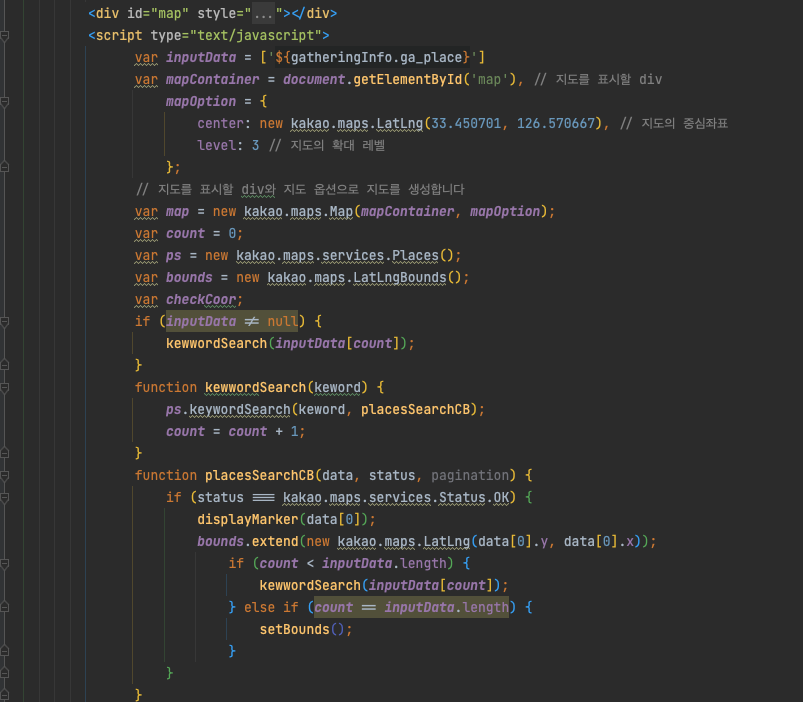
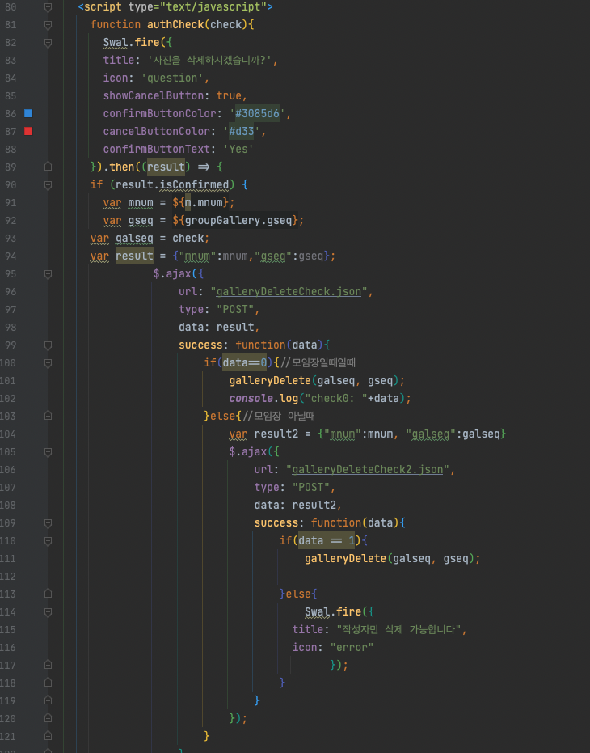

# Togather
Togather는 _모으다_ 는 뜻의 Gather와 _함께_ 라는 뜻의 Together를 합쳐  
spelling은 To Gather를, 발음은 Together를 의도하여 만든 서비스명입니다. 

### 프로젝트 개요

_기간_  
'22.03.23 ~ '22.04.21  
사용기술: Java, Oracle DB, Spring, maven, myBatis

_기획의도_ 
모바일 커뮤니티 플랫폼 서비스인 <a href="https://www.friendscube.com" target="_blank">소모임</a>을 벤치마킹하여  
웹 어플리케이션 구현
 
<a href="https://youtu.be/qxBty3xQ-WU" target="_blank">시연영상</a> 
 

# ToGather

## 🎯 Topic

- 지역별 관심사별 오프라인 모임을 할 수 있는 웹 커뮤니티 플랫폼 서비스
- KOSMO 풀스택 개발자 과정 최우수 프로젝트 수상
- Togather는 gather(모으다)와 together(함께)의 의미를 담고 있습니다

## 🗒️ Summary

COVID-19으로 인한 사회적 거리두기에 따라 2년 이상 동호회 및 그룹 취미활동이 이루어지지 못했습니다.

하지만 이제 점차 With-Covid로 다시 그룹활동을 할 수 있게 되었고 같은 지역, 같은 관심사를 가진 고객들이 

쉽게 모임을 구성하고 정모를 통한 오프라인 만남을 가질 수 있도록 하는 서비스입니다.

## ❗ Key Function

- 200개 이상의 세분화 된 관심사
    - 대주제 - 중간주제 - 소주제를 통한 관심사 설정 세분화
    - 회원가입시 설정한 3가지 관심사를 기반으로 인덱스 페이지에 해당 관심사를 가진 모임을 보여줌
    - 대주제를 통한 검색으로 이하 모든 주제를 검색 가능
- 권한에 따른 접근성 구분
    - 페이지 관리자, 일반회원, 모임장, 정모장 등의 권한으로 회원관리, 모임삭제, 모임수정 등의 접근을 구분
    - 게시글 및 댓글 등은 작성자 및 권한을 가진 회원만 수정, 삭제가 가능하도록 구분
- 모임
    - 소주제 1가지 와 지역을 바탕으로 모임을 생성하며 최대인원, 모임소개, 모임메인사진 등의 기능 설정
    - 모임 페이지 내에 모임정보와 사진첩, 게시판으로 구성
    - 모임 정보페이지에서 모임가입 회원들의 정보 확인 및 쪽지보내기
    - 모임 회원들끼리만 가능한 채팅
- 정모
    - Kakao Map API를 활용하여 정모 장소를 지도로 확인 가능
    - 기상청 API로 정모날 및 전 후 날씨를 확인 가능
    - 정모 참여자 목록을 보여줌

## 💁🏻‍♂️ My Part

- 정모
    - DB 설계 및 구현
    - 정모페이지 CRUD
    - 정모 생성자 및 일반참여자의 권한 설정
    - Kakao Map API
- 모임
    - 사진첩 구현
    - 모임정보 페이지 내 생성된 정모 목록의 정보를 넘겨주는 기능
- 인덱스
    - 회원가입시 설정된 관심사를 기반으로 모임을 보여주는 기능
    - 모임 검색시 대주제를 기반으로 이하 모든 주제의 모임을 찾아주는 기능
- 프론트페이지
    - 전반적인 프론트페이지 구성
- 형상관리
    - git/GitHub를 통한 형상관리 총괄
    

## 😲 What I learn is..

- DB에 원하는 데이터를 받기위한 쿼리문 작성에 대한 전반적인 이해도 증가
    - 회원가입시 설정한 3가지 관심사를 기반으로 생성된 모임 중 해당하는 관심사를 가진 모임을 인덱스페이지에서 띄워줘야 했다. 쿼리문을 작성하다보니 DB 회원 테이블에 들어간 관심사가 각각의 칼럼에 설정되어 있어서 `INTERSECT`로 비교해서 뽑아 올 수 없었다. (모임테이블에 관심사는 1개의 칼럼, 회원테이블에 관심사는 각각 3개의 칼럼이기 때문에 교집합을 찾을 수 없음) 
    해결방안을 찾다가 회원테이블에 있는 unique값인 email을 기준으로 두고 `UNION ALL` 을 통해 email 칼럼 밑에 관심사를 넣어 하나의 칼럼에 3가지 관심사를 넣고 `INTERSECT`로 비교하여 원하는 데이터를 불러 올 수 있었다.
- Spring의 빈생성과 DI가 어떻게 이루어지는 지에 대한 흐름을 알 수 있었음
- API의 사용방법에 대해 이해함
- 본인은 혼자만 mac os를 사용하여 프로젝트를 진행해야 했는데, Cloud DB를 사용해야 했다거나 IDE세팅을 달리해야 했다는 점에 애로가 있었으나 오히려 다양한 os에서 프로젝트 구성을 할 수 있게 되었음
- 프로젝트 설계단계가 얼마나 중요한지에 대해 뼈저리게 느낄 수 있었고 팀프로젝트의 경우, 변수명의 통일, 
주석 등과 같은 세세한 부분까지도 설계단계에서 충분한 논의가 필요함을 깨달음
- 주기적인 회의 및 서로간의 소통으로 보내는 시간이 오히려 두 번 일하지 않게 하는 시간을 아끼는 시간임을
다시금 알게 되었음

## ⌨️ Codes

(전체 코드는 github를 통해 확인하실 수 있습니다)

### DB 구성

---

### 회원별 관심사에 맞는 모임을 보여주기

- 프로그래머/개발직 , 축구/풋살, 온라인게임 을 관심사로 가진 회원

- 생성 되어있는 모임들 중 해당 관심사에 부합하는 모임들이 인덱스 화면에 보여짐

- 해당 데이터를 가져오기 위한 쿼리문 (GroupTabMapper.xml)

---

### 정모 생성

- 정모 만들기 페이지

- 장소 검색하기 버튼을 통해 지도에서 선택 or 직접 입력

- 생성된 정모 정보 (참여 인원수에 마우스를 올리면 참석중인 멤버 확인가능)

- GatheringController의 정모 생성부분

- GatheringController의 정모 Info부분

- Kakao Map API (gatheringInfo.jsp)

---

### 모임내 사진첩

- 페이지 당 6장의 사진이 보여지며 마우스 오버시 우측상단에 삭제를 위한 버튼 활성화

- 클릭하여 크게 보기

- 삭제 권한 설정

- 권한 체크

